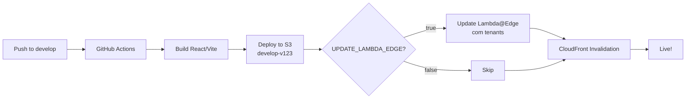

# Configuração de Secrets no GitHub

## Como Configurar

1. Acesse: `https://github.com/YOUR_ORG/YOUR_REPO/settings/secrets/actions`
2. Ou: **Repository Settings** → **Secrets and variables** → **Actions** → **Secrets**

---

## ✅ Secrets Obrigatórios

### `AWS_ACCESS_KEY_ID`

**Descrição:** Chave de acesso AWS para autenticação  
**Como obter:**

1. AWS Console → IAM → Users → Seu usuário
2. Security credentials → Create access key
3. Copie o Access Key ID

**Permissões necessárias:**

- `s3:PutObject`
- `s3:DeleteObject`
- `s3:ListBucket`
- `cloudfront:CreateInvalidation`
- `cloudfront:DescribeFunction`
- `cloudfront:UpdateFunction`
- `cloudfront:PublishFunction`

---

### `AWS_SECRET_ACCESS_KEY`

**Descrição:** Chave secreta AWS (par da Access Key)  
**Como obter:** Gerada junto com o Access Key ID (anote imediatamente, não pode ser recuperada depois)

---

## ⚙️ Como os Workflows Usam

### develop.yaml

```yaml
- name: Configure AWS Credentials
  uses: aws-actions/configure-aws-credentials@v4
  with:
    aws-access-key-id: ${{ secrets.AWS_ACCESS_KEY_ID }}
    aws-secret-access-key: ${{ secrets.AWS_SECRET_ACCESS_KEY }}
    aws-region: us-east-2
```

### main.yaml

Mesmo uso do develop.yaml.

---

## 🔐 Segurança

**✅ Boas práticas:**

- Use um usuário IAM dedicado para CI/CD (não use root account)
- Aplique princípio do menor privilégio (somente as permissões necessárias)
- Considere usar IAM Roles para GitHub Actions (mais seguro que access keys)
- Rotacione as credenciais periodicamente

**❌ Nunca faça:**

- Commitar secrets no código
- Compartilhar secrets em canais inseguros
- Usar credenciais pessoais (crie um usuário específico para CI/CD)

---

## 📋 Policy IAM Recomendada

Crie uma policy customizada para o usuário de CI/CD:

```json
{
  "Version": "2012-10-17",
  "Statement": [
    {
      "Sid": "S3DeployAccess",
      "Effect": "Allow",
      "Action": ["s3:PutObject", "s3:PutObjectAcl", "s3:DeleteObject", "s3:ListBucket"],
      "Resource": ["arn:aws:s3:::vivacash-frontend", "arn:aws:s3:::vivacash-frontend/*"]
    },
    {
      "Sid": "CloudFrontInvalidation",
      "Effect": "Allow",
      "Action": ["cloudfront:CreateInvalidation", "cloudfront:GetInvalidation"],
      "Resource": "arn:aws:cloudfront::*:distribution/E1PQ2RJZYTOCQ9"
    },
    {
      "Sid": "CloudFrontFunctionManagement",
      "Effect": "Allow",
      "Action": [
        "cloudfront:DescribeFunction",
        "cloudfront:UpdateFunction",
        "cloudfront:PublishFunction",
        "cloudfront:GetFunction"
      ],
      "Resource": "arn:aws:cloudfront::*:function/VivaCashRouter"
    }
  ]
}
```

**Nome sugerido:** `VivaCashCICDPolicy`

---

## 🧪 Validação

Para verificar se as credenciais estão funcionando:

```bash
# Localmente, exporte as credenciais
export AWS_ACCESS_KEY_ID="sua-access-key"
export AWS_SECRET_ACCESS_KEY="sua-secret-key"

# Teste S3
aws s3 ls s3://vivacash-frontend/ --region us-east-2

# Teste CloudFront
aws cloudfront list-invalidations --distribution-id E1PQ2RJZYTOCQ9

# Teste CloudFront Functions
aws cloudfront describe-function --name VivaCashRouter --stage LIVE
```

Se todos os comandos funcionarem sem erros 403, suas credenciais estão corretas!

---

## 🔄 Rotação de Credenciais

**Quando rotacionar:**

- A cada 90 dias (recomendado)
- Quando um membro da equipe com acesso sair
- Se suspeitar de vazamento

**Como rotacionar:**

1. AWS Console → IAM → Users → Seu usuário CI/CD
2. Security credentials → Create new access key
3. Atualizar secrets no GitHub (não delete a antiga ainda!)
4. Testar novo deploy
5. Depois de confirmar funcionamento, delete a access key antiga

---

## ❓ Troubleshooting

### Erro: "Could not load credentials from any providers"

**Causa:** Secrets não configurados ou nomes incorretos

**Solução:** Verifique que os secrets existem com os nomes exatos:

- `AWS_ACCESS_KEY_ID` (não `AWS_ACCESS_KEY`)
- `AWS_SECRET_ACCESS_KEY` (não `AWS_SECRET_KEY`)

### Erro: "Access Denied" ao fazer upload S3

**Causa:** Policy IAM não tem permissão `s3:PutObject`

**Solução:** Adicione a policy S3 ao usuário IAM

### Erro: "InvalidArgument" ao publicar CloudFront Function

**Causa:** Falta permissão `cloudfront:PublishFunction`

**Solução:** Adicione a policy CloudFront ao usuário IAM

---

## 🎯 Fluxo Completo



---

## 🧪 Como Testar

### 1. Configurar variáveis mínimas

```
VIVACASH_DEV = dev
VIVACASH_MAIN = www
```

### 2. Fazer push para `develop`

```bash
git checkout develop
git push origin develop
```

### 3. Verificar deploy no S3

```bash
aws s3 ls s3://vivacash-frontend/ --recursive | grep develop
```

### 4. _(Depois)_ Habilitar Lambda

```
UPDATE_LAMBDA_EDGE = true
```

---

## 📞 Troubleshooting

### Erro: "VIVACASH_DEV not found"

- Verifique se a variável está criada na **Organization**, não no Repository
- Verifique Visibility = "Private repositories"

### Lambda não atualiza mesmo com UPDATE_LAMBDA_EDGE=true

- Verifique se a função Lambda existe no AWS (região us-east-1)
- Verifique permissões IAM do usuário AWS

### 403 ao acessar domínio

- Tenant não está na lista permitida
- Verifique se o domínio está associado ao CloudFront (CNAMEs)
- Verifique se a Lambda está anexada ao Distribution
